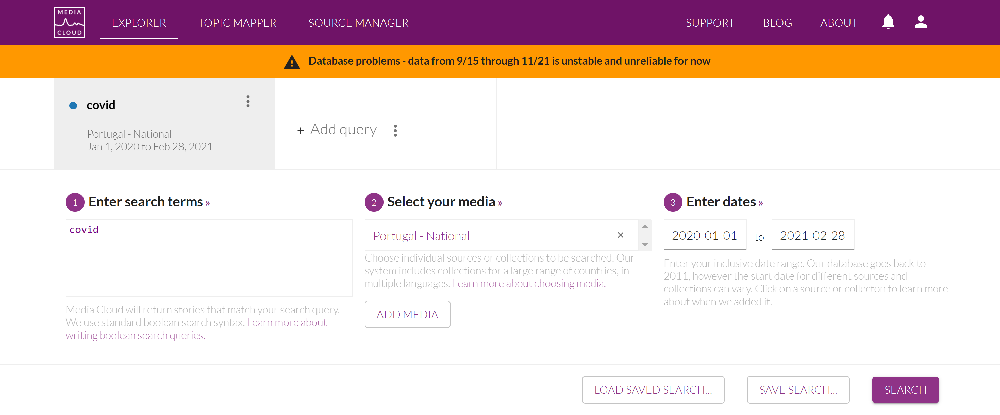

# mediacloudAPI_endpoint

A Python endpoint to query the Mediacloud API service directly from the command line. Designed for mapping coverage of geographical collections efficiently. 

Configure your Mediacloud API private key in a file called **confi.ini** (you may copy it from the *config.ini.sample*).

The module usage is described below:

```
usage: mc_api.py [-h] --input_fp INPUT_FP --collectionId COLLECTIONID --startDate STARTDATE --endDate ENDDATE

Querying the Mediacloud API from CLI.

optional arguments:
  -h, --help            show this help message and exit
  --input_fp INPUT_FP   Input file path - should contain one query per line following the adequate Mediacloud syntax.
  --collectionId COLLECTIONID
                        Collection id of the Mediacloud geo collection
  --startDate STARTDATE
                        Date string for start of query interval - format YYYY-MM-DD
  --endDate ENDDATE     Date string for end of query interval - format YYYY-MM-DD
```

More info on how to write queries here: https://mediacloud.org/support/query-guide

Example usage with the Portugal-National collection (https://sources.mediacloud.org/#/collections/34412337):

```
pipenv run python mc_api.py --input_fp './input/keyword_list.txt' --collectionId 34412337 --startDate '2020-01-01' --endDate '2020-02-28'
```

Results will be written to the **output** folder, with some summary statistics.

An additional utility is provided for merging results, dropping duplicate articles, while also providing summary statistics in the **merger.py** module. After running the *mc_api.py* module run:

```
pipenv run python merger.py
```

And check results in the **merged** folder.

</img>